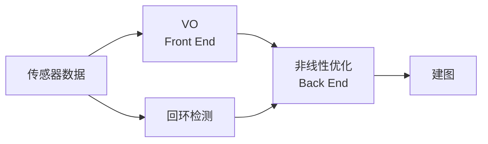

# 视觉slam十四讲

- [x] 第2讲：初识SLAM		全部

- [x] 第7讲：视觉里程计1		7.1+7.2+7.3

## 经典视觉SLAM框架

## SLAM工作场景

* 静态
* 刚体
* 光照变化不明显
* 无人为干扰

## 各个模块

1. VO

   通过相邻帧间图像估计相机的运动，但会出现**累计漂移**，所以需要**后端优化**和**回环检测**解决**漂移**问题。前端与**计算机视觉**领域更相关。

2. 后端优化

   从前端提供的带噪数据中，估计整个系统的状态（包括自身轨迹和地图）。也是早期SLAM问题所要解决的东西：对运动主体自身和周围环境空间不确定性的估计。后端主要是**滤波**与**非线性优化算法**。

3. 回环检测

   主要解决位置估计**随时间漂移**的问题。使用某种手段（如判断图像间相似性）让机器人知道自己回到了原点，从而调整位置估计值，**消除累积误差**。

4. 建图

   地图形式视SLAM的应用场景而定。大体分**度量地图**和**拓扑地图**。
   度量地图强调**精确**表示地图中物体位置关系。又分为**稀疏**（用于定位）和**稠密**（用于导航）。缺点是耗费大量存储空间，有时会出现一致性问题。
   拓扑地图强调地图元素间的关系。缺点是不擅长表达具有复杂结构的地图。

## SLAM的数学表述

建模成**状态估计问题**，分为**线性/非线性**和**高斯/非高斯**系统。最简单的是**LG系统**，其无偏最优估计可以由**KF**给出；而复杂的**NLNG系统**需要使用**EKF**和**非线性优化**两大类方法求解（早期）。后来为了克服EKF缺点（如线性化误差和噪声高斯分布假设），开始使用**粒子滤波器**等其他滤波器，乃至使用**非线性优化**方法。主流SLAM使用以**图优化**为代表的优化技术进行状态估计。目前认为优化技术**优于**滤波器技术。

## 视觉里程计1

1. VO主流方法：特征点法。特征点由**关键点**和**描述子**两部分组成。

   > SIFT：充分考虑了在图像变换过程中出现的光照，尺度，旋转等变化，但计算量极大。
   >
   > FAST关键点（无描述子）：计算特别快的一种特征点。
   >
   > ORB 特征：具有代表性的实时图像特征。改进了FAST检测子 不具有方向性的问题，并采用速度极快的二进制描述子 BRIEF，使整个图像特征提取的环节大大加速。是质量与性能之间较好的折中。

2. 提取ORB特征步骤

   > FAST角点提取：仅比较像素间亮度的差异。并在第一遍检测后使用**非极大值抑制**避免角点集中问题。
   >
   > Oriented FAST：添加了**尺度**和**旋转**的描述。尺度不变性由构建图像金字塔（对图像进行不同层次的降采样，以获得不同分辨率的图像），并在金字塔的每一层上检测角点来实现。特征的旋转是由**灰度质心法**实现。提升在不同图像之间表述的鲁棒性。
   >
   > BRIEF描述子：原始的 BRIEF 描述子不具有旋转不变性，在图像发生旋转时容易丢失。而 ORB 在 FAST 特征点提取阶段计算了关键点的方向，使 ORB 的描述子具有较好的旋转不变性。

   

3. 特征匹配（已集成到OpenCV）

   最简单的特征匹配方法是**暴力匹配**，但在特征点数量多时运算量较大。**快速近似最近邻（FLANN）算法**更加适合于匹配点数量极多的情况。

   

4. 估计运动

   * 单目相机：根据两组 2D 点估计运动，用**对极几何**解决
   * 双目相机、RGB-D：根据两组 3D 点估计运动，用**ICP**解决
   * 有 3D 点和它们在相机的投影位置：用**PnP**求解

   

5. 2D-2D: 对极几何

   由**对极约束**，求基础矩阵***E***或本质矩阵***F***，由***E***或***F***，求***R***，***t***。
   分解***E***得到的四个解，通过计算是否是**两个正深度**来确定正解。

   

6. 单应性在 SLAM 中的意义

   当特征点共面，或者相机发生纯旋转的时候，基础矩阵的自由度下降，这就出现**退化**。为避免退化现象造成的影响，通常同时估计基础矩阵 ***F*** 和单应矩阵 ***H***，选择重投影误差比较小的那个作为最终的运动估计矩阵。
   
   > 单应矩阵***H***：若场景中的特征点都落在同一平面上（比如墙，地面等），则可以通过单应性来进行运动估计。这种情况在无人机携带的俯视相机，或扫地机携带的顶视相机中比较常见。

# 机器学习和神经网络部分

先看了一部分的视频，还么的写总结...
