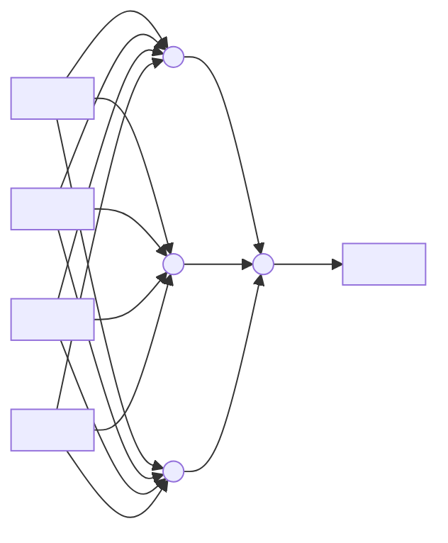

# 神经网络

视频资源：

* [吴恩达深度学习课程](https://www.bilibili.com/video/BV164411m79z?spm_id_from=333.999.0.0)
* [3Blue1Brown 深度学习系列](https://space.bilibili.com/88461692/channel/detail?cid=26587)（喜欢他的各系列视频，对入门者友好，比较直观）

深度学习基础都是监督学习

> 规模（包括数据规模和神经网络规模）推动深度学习的进步。
>
> Scale drives deep learning progress.

## 种类

1. **标准神经网络**

   房价、广告预测

2. **卷积神经网络**

   图像领域

3. **循环神经网络**

   序列数据

   * 如语音是一维时间序列
   * 语言文字也是序列数据

## 流行原因

数据规模越大，神经网络越优于传统机器学习；但数据规模较小时，效果类似。

## 监督学习

1. 结构化数据

   房价预测数据、个性化推荐用户数据（广告系统）

2. 非结构化数据（更难）

   音频、图像、文本

## 机器学习与深度学习

#### 常用机器学习算法(Algorithms)

* 决策树
* 随机森林
* 逻辑回归
* SVM
* 朴素贝叶斯
* K近邻算法（KNN）：分类算法，有监督学习，K代表K个最接近的邻居。
* K均值算法（K-Means）：聚类算法，无监督学习，K代表分成K类。
* Adaboost算法
* **神经网络**
* 马尔可夫

#### 深度学习

模拟人脑进行分析学习的神经网络。显著应用于**计算机视觉**和**NLP**领域。是“改良版的神经网络”。

## 三要素

* Data

* Computation

* Algorithms

 > 算法创新的本质是为了增加计算（迭代）速度。

## Logisitic Regression

* **lost function**(error function)
  此损失函数不适用于梯度下降法，
  导致局部最优解而非全局最优解：
$$
L(\hat{y},y)=\frac{1}{2}\times(\hat{y}-y)^2
$$
​		实际使用：
$$
L(\hat{y},y)=-(y\log{\hat{y}}+(1-y)\log{(1-\hat{y})})
$$

* **cost function**
  衡量在全体训练样本上的表现，越小越好
  $$
  J(w,b)=\frac{1}{m}\sum_{i=1}^{m}{L(\hat{y}^{(i)},y^{(i)})}=-\frac{1}{m}\sum_{i=1}^{m}{(y^{(i)}\log{\hat{y}^{(i)}}+(1-y^{(i)})\log{(1-\hat{y}^{(i)})})}
  $$

## 梯度下降法

### 反向传播BP

实质：微积分求导链式法则

用于修正各层 weights 和 bias：
$$
w=w-\alpha\times\frac{\partial {J(w,b)}}{\partial {w}}\\
b=b-\alpha\times\frac{\partial {J(w,b)}}{\partial {b}}
$$

## 卷积神经网络（CNN）

CNN可视化网址：<https://poloclub.github.io/cnn-explainer/>

* 卷积层：使用多个卷积核（$n*n$ 过滤器）对原图像滑动卷积

  * 作用：特征提取
  * 卷积核：kernel，一个$n*n$的矩阵，矩阵元素是权重
  * Padding：为了使图像不缩小，在外围补上 $n-1$ 行与 $n-1$ 列，否则卷积后的图像比原图像小（有误，待更正）
  * 超参数：卷积核的大小

* 激活层：**Sigmoid**，**ReLU**函数等
  $$
  \sigma (x)=\cfrac 1 {1+e^{-x}}\\
  \sigma (x) = max(0,x)
  $$
  

* 池化层：平均池化和最大池化，常用**最大池化（Max Pooling）**保留主要特征的同时减少参数和计算量，防止过拟合（直观感受：让图片变糊）。**池化层无参数**

* 全连接层：

  * 在整个卷积神经网络中起到**分类器**的作用

  * 核心操作是矩阵向量乘积
    $$
    y=W^T\cdot{x}
    $$

## 向量化

> 代替显式for循环

## ...（神经网络部分学到这里）

___

## 视觉SLAM十四讲

- [x] 第3讲：三维空间刚体运动

- [x] 第5讲：相机与图像

粗略看了这两讲的全部，具体数学推导下次写吧...

___

## 文献搜集

### 已搜集：

[1] 陈宗海洪洋, CHEN ZONGHAI H Y. 基于循环卷积神经网络的单目视觉里程计[J]. 机器人, 2019, 41(2): 147–155. DOI:[10.13973/j.cnki.robot.180314](https://doi.org/10.13973/j.cnki.robot.180314).

[2] LI X, BELAROUSSI R. Semi-Dense 3D Semantic Mapping from Monocular SLAM[J/OL]. arXiv:1611.04144 [cs], 2016[2021–10–30]. http://arxiv.org/abs/1611.04144.

[3] QIN T, LI P, SHEN S. VINS-Mono: A Robust and Versatile Monocular Visual-Inertial State Estimator[J]. IEEE Transactions on Robotics, 2018, 34(4): 1004–1020. DOI:[10.1109/TRO.2018.2853729](https://doi.org/10.1109/TRO.2018.2853729).

### 已粗略阅读：

[1] 胡凯,吴佳胜,郑翡,等. 视觉里程计研究综述[J]. 南京信息工程大学学报,2021,13(3):269-280. DOI:10.13878/j.cnki.jnuist.2021.03.002.

[2] 陈剑斌. 基于深度学习和传统视觉SLAM融合的单目视觉LSLAM[D]. 重庆:重庆大学,2018.

[3] 李慧霞. 多传感器组合的室内定位方法研究[D]. 江西:南昌大学,2020.

暂未总结...
